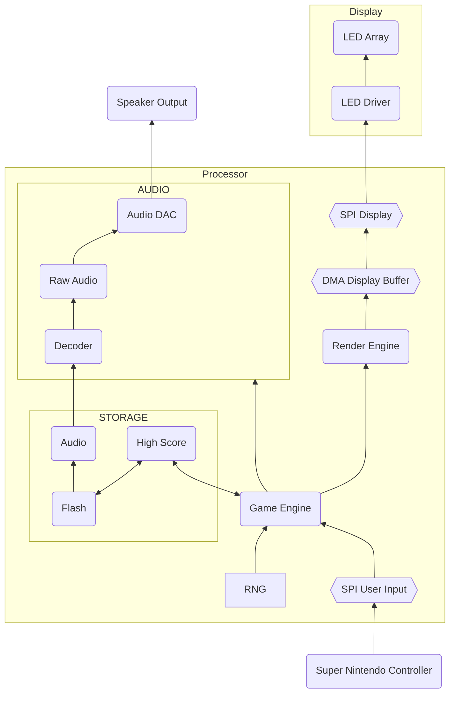

```mermaid
  flowchart BT
    Display
    subgraph Display
        LED_ARRAY(LED Array)
        LED_DRIVER(LED Driver)
        LED_DRIVER-->LED_ARRAY
    end

    SPEAKER_OUT(Speaker Output)
    AUDIO_DAC-->SPEAKER_OUT
    SPI_DISP-->LED_DRIVER
    
    Processor
    subgraph Processor
        SPI_DISP{{SPI Display}}
        BUFFER{{DMA Display Buffer}}
        BUFFER-->SPI_DISP
        RENDER_ENGINE(Render Engine)
        RENDER_ENGINE-->BUFFER
        GAME_ENGINE(Game Engine)<-->HIGH_SCORE
        GAME_ENGINE--->RENDER_ENGINE
        GAME_ENGINE-->AUDIO
        RNG
        RNG-->GAME_ENGINE
        SPI_UI{{SPI User Input}}
        SPI_UI-->GAME_ENGINE
        subgraph AUDIO
            RAW_AUDIO(Raw Audio)
            DECODER(Decoder)
            DECODER-->RAW_AUDIO
            AUDIO_DAC(Audio DAC)
            RAW_AUDIO-->AUDIO_DAC
        end
        subgraph STORAGE
            FLASH(Flash)<-->HIGH_SCORE(High Score)
            FLASH-->AUDIO_FILE(Audio)
        end
        AUDIO_FILE-->DECODER
    end
    SNES_CONT(Super Nintendo Controller)
    SNES_CONT-->SPI_UI
```