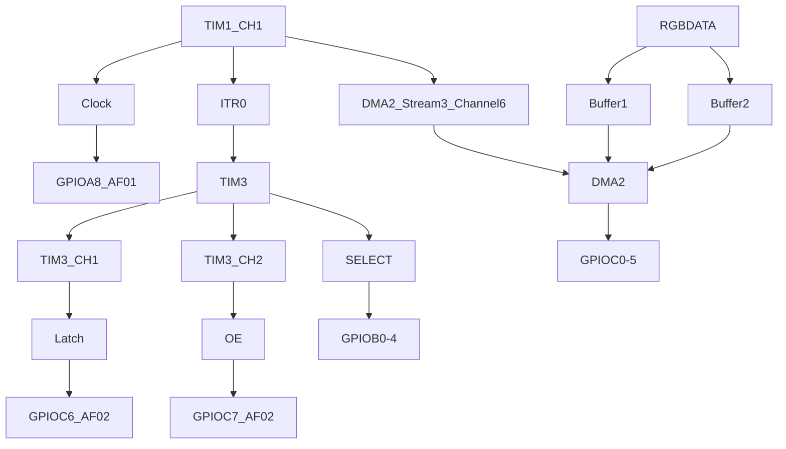

```mermaid
  flowchart TB
    RGBDATA
    Buffer1
    Buffer2
    Clock
    Latch
    OE
    TIM1_CH1
    TIM3
    TIM3_CH1
    TIM3_CH2
    DMA2_Stream3_Channel6
    DMA2
    GPIOC0-5
    GPIOB0-4
    GPIOA8_AF01
    GPIOC6_AF02
    GPIOC7_AF02

  TIM1_CH1-->Clock
  Clock-->GPIOA8_AF01
  Latch-->GPIOC6_AF02
  OE-->GPIOC7_AF02
  TIM1_CH1-->ITR0-->TIM3
  TIM3-->TIM3_CH1
  TIM3-->TIM3_CH2
  TIM3_CH1-->Latch
  TIM3_CH2-->OE
  TIM3-->SELECT
  SELECT-->GPIOB0-4
  TIM1_CH1-->DMA2_Stream3_Channel6
  DMA2_Stream3_Channel6-->DMA2
  RGBDATA-->Buffer1
  RGBDATA-->Buffer2
  Buffer1-->DMA2
  Buffer2-->DMA2
  DMA2-->GPIOC0-5
```