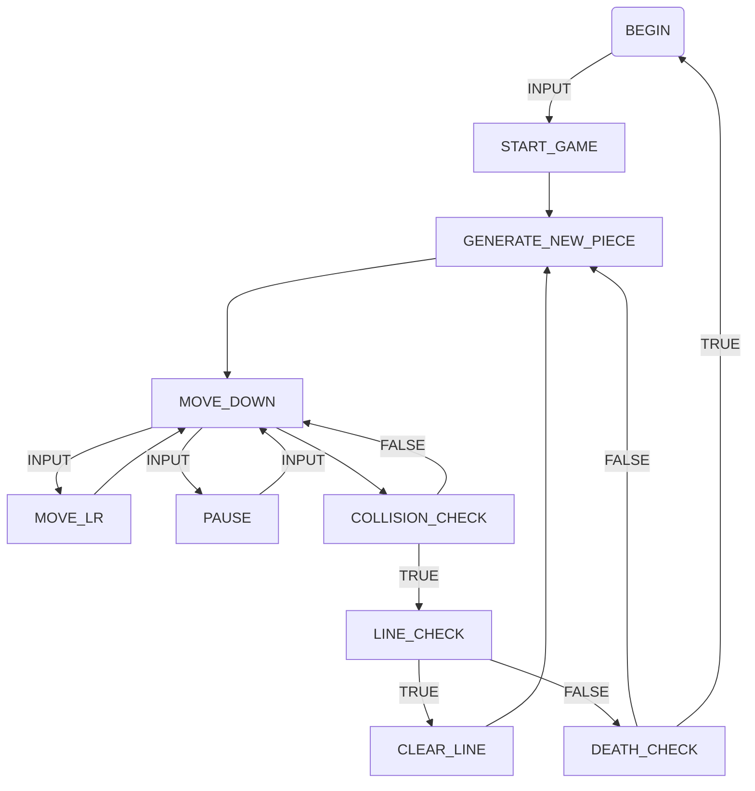

```mermaid
  graph TD
    BEGIN
    
    START_GAME

    GENERATE_NEW_PIECE
    
    MOVE_DOWN
    
    MOVE_LR
    PAUSE
    COLLISION_CHECK
    
    LINE_CHECK
    CLEAR_LINE
    DEATH_CHECK
    
    MOVE_DOWN-->COLLISION_CHECK
    MOVE_DOWN--INPUT-->MOVE_LR-->MOVE_DOWN
    MOVE_DOWN--INPUT-->PAUSE--INPUT-->MOVE_DOWN
    COLLISION_CHECK--FALSE-->MOVE_DOWN
    GENERATE_NEW_PIECE--->MOVE_DOWN
    LINE_CHECK--TRUE-->CLEAR_LINE
    LINE_CHECK--FALSE-->DEATH_CHECK
    BEGIN(BEGIN)--INPUT-->START_GAME
    DEATH_CHECK--FALSE-->GENERATE_NEW_PIECE
    DEATH_CHECK--TRUE-->BEGIN
    COLLISION_CHECK--TRUE-->LINE_CHECK
    START_GAME-->GENERATE_NEW_PIECE
    CLEAR_LINE-->GENERATE_NEW_PIECE
```