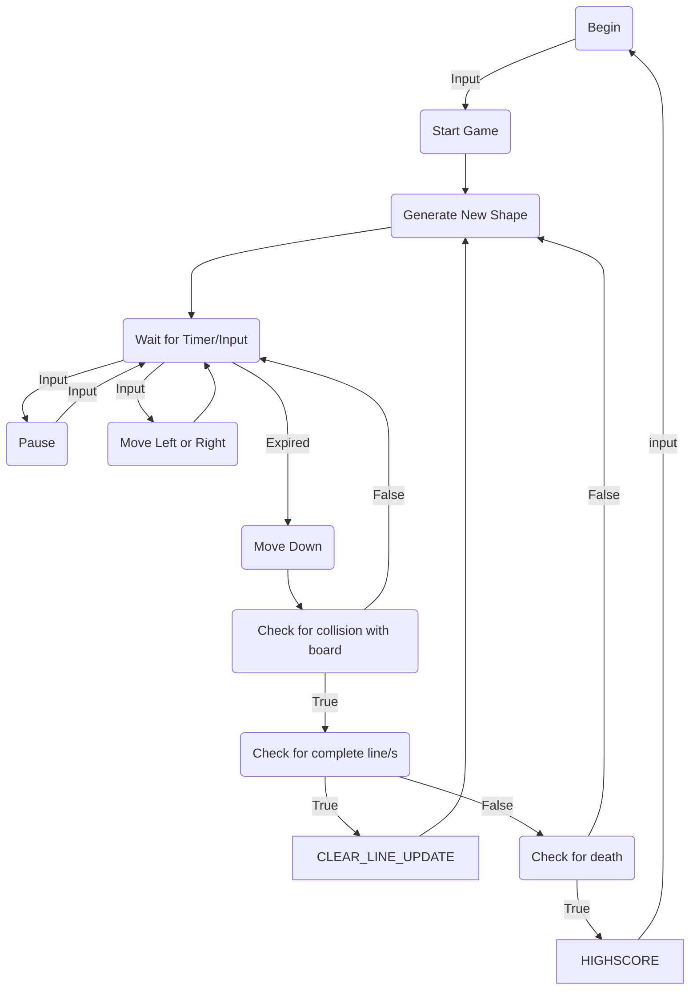

```mermaid
  graph TB    
    BEGIN(Begin)--Input-->START_GAME
    START_GAME(Start Game)-->GENERATE_NEW_SHAPE
    MOVE_DOWN(Move Down)-->COLLISION_CHECK
    WAIT(Wait for Timer/Input)--Input-->PAUSE(Pause)--Input-->WAIT
    WAIT--Input-->MOVE_LR(Move Left or Right)-->WAIT
    COLLISION_CHECK(Check for collision with board)--False-->WAIT
    GENERATE_NEW_SHAPE(Generate New Shape)--->WAIT
    WAIT--Expired--->MOVE_DOWN
    LINE_CHECK(Check for complete line/s)--True-->CLEAR_LINE_UPDATE
    LINE_CHECK--False-->DEATH_CHECK
    DEATH_CHECK(Check for death)--False-->GENERATE_NEW_SHAPE
    DEATH_CHECK--True-->HIGHSCORE
    COLLISION_CHECK--True-->LINE_CHECK
    CLEAR_LINE_UPDATE-->GENERATE_NEW_SHAPE
    HIGHSCORE--input-->BEGIN
```
