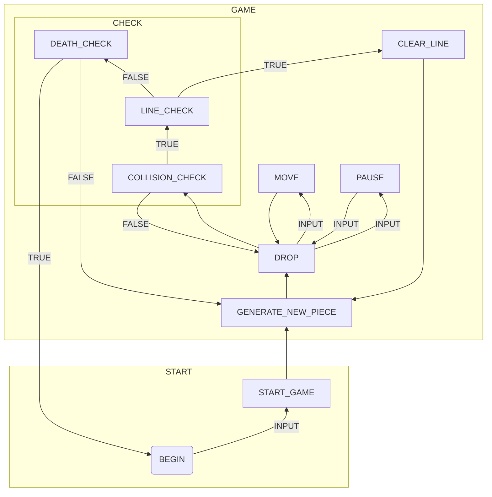

```mermaid
  graph BT
    BEGIN(BEGIN)--INPUT-->START_GAME
    START_GAME-->GENERATE_NEW_PIECE
    GENERATE_NEW_PIECE-->DROP
    CLEAR_LINE-->GENERATE_NEW_PIECE
    DROP-->COLLISION_CHECK

    DROP--INPUT-->MOVE-->DROP
    DROP--INPUT-->PAUSE--INPUT-->DROP

    subgraph START
      BEGIN
      START_GAME
    end

    subgraph GAME
      direction RL
      GENERATE_NEW_PIECE
      DROP
      CLEAR_LINE
      MOVE
      PAUSE
      
      subgraph CHECK
        COLLISION_CHECK
        DEATH_CHECK
        LINE_CHECK
      end
    end

    DEATH_CHECK--FALSE-->GENERATE_NEW_PIECE
    LINE_CHECK--FALSE-->DEATH_CHECK
    LINE_CHECK--TRUE-->CLEAR_LINE
    DEATH_CHECK--TRUE-->BEGIN
    COLLISION_CHECK--TRUE-->LINE_CHECK
    COLLISION_CHECK--FALSE-->DROP
```